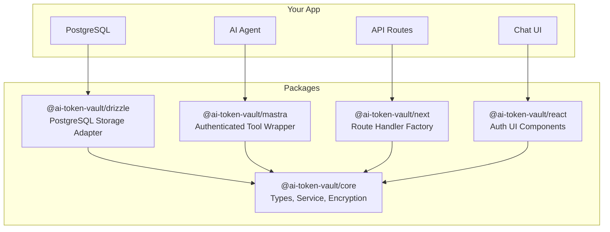
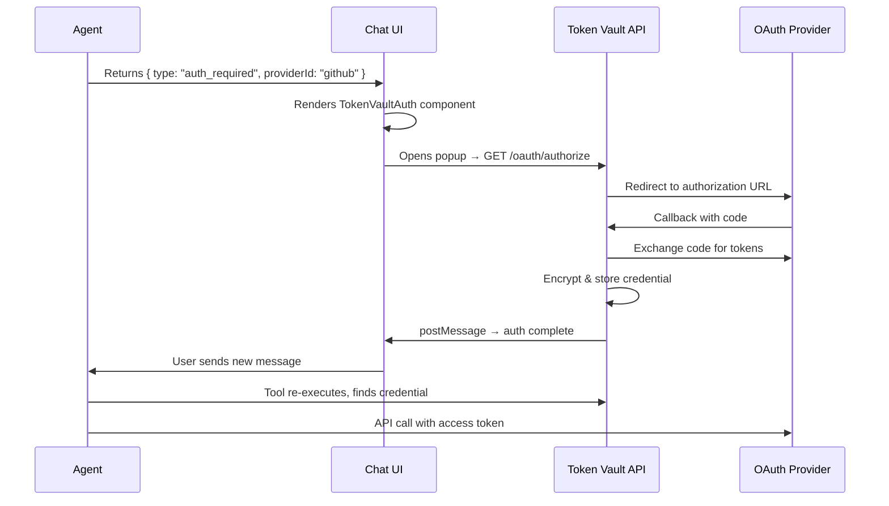
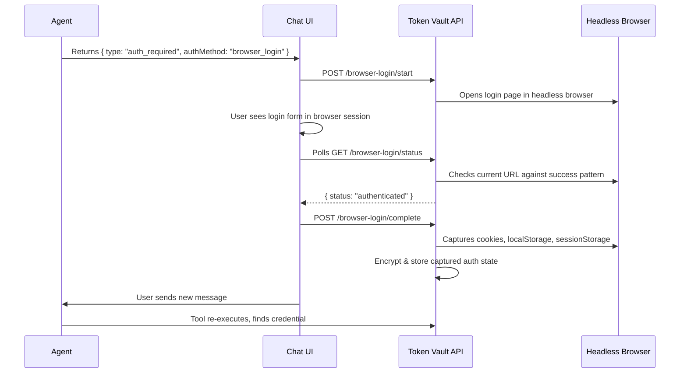

# AI Token Vault

Credential management for AI agents. Enables agents to pause mid-execution, prompt users to authenticate with external services (OAuth2 or browser login), then resume with valid credentials.

## Architecture



### Adapter Pattern

The core package defines four adapter interfaces — swap implementations without changing business logic:

| Adapter | Purpose | Default Implementation |
|---------|---------|----------------------|
| `StorageAdapter` | CRUD for providers, credentials, OAuth configs | `@ai-token-vault/drizzle` or `createMemoryStorage()` |
| `EncryptionAdapter` | Encrypt/decrypt sensitive fields | `createAes256GcmEncryption()` |
| `SessionAdapter` | Extract user from request | Bring your own (Better Auth, NextAuth, etc.) |
| `BrowserAdapter` | Optional browser automation for login | Bring your own (Stagehand, Playwright, etc.) |

## Quick Start

```bash
pnpm add @ai-token-vault/core @ai-token-vault/next @ai-token-vault/react
```

```ts
// lib/vault.ts
import { createTokenVault, createAes256GcmEncryption, createMemoryStorage } from '@ai-token-vault/core';

const vault = createTokenVault({
  storage: createMemoryStorage(), // or createDrizzleStorage(db, schema)
  encryption: createAes256GcmEncryption(process.env.TOKEN_VAULT_SECRET!),
});
```

```ts
// app/api/token-vault/[...path]/route.ts
import { createTokenVaultRouteHandler } from '@ai-token-vault/next';

const handler = createTokenVaultRouteHandler({ vault, session: mySessionAdapter });
export { handler as GET, handler as POST, handler as DELETE };
```

## Auth Flows

### OAuth2 Flow



### Browser Login Flow



## Mastra Integration

```ts
import { createAuthenticatedTool } from '@ai-token-vault/mastra';
import { z } from 'zod';

const listRepos = createAuthenticatedTool({
  id: 'github-list-repos',
  description: 'List GitHub repositories for the authenticated user',
  providerId: 'github',
  providerName: 'GitHub',
  vault, // injected, not imported globally
  inputSchema: z.object({ page: z.number().optional() }),
  execute: async (input, { credential }) => {
    const res = await fetch('https://api.github.com/user/repos', {
      headers: { Authorization: `Bearer ${credential.accessToken}` },
    });
    return res.json();
  },
});
```

## Drizzle Storage (PostgreSQL)

```ts
import { createDrizzleStorage, createTokenVaultSchema } from '@ai-token-vault/drizzle';
import { user, organization } from './your-auth-schema'; // optional FK references

const schema = createTokenVaultSchema({ userTable: user, organizationTable: organization });
const storage = createDrizzleStorage(db, schema);
const vault = createTokenVault({ storage, encryption });
```

## Provider Configs

Pre-built provider configurations:

```ts
import { githubOAuthProvider, githubBrowserProvider } from '@ai-token-vault/core';
```

## Packages

| Package | Description |
|---------|------------|
| `@ai-token-vault/core` | Pure TS, zero deps — types, service, encryption, in-memory storage |
| `@ai-token-vault/drizzle` | Drizzle ORM storage adapter + schema factory |
| `@ai-token-vault/mastra` | `createAuthenticatedTool()` wrapper for Mastra agents |
| `@ai-token-vault/next` | Next.js route handler factory (8 endpoints) |
| `@ai-token-vault/react` | React UI — `TokenVaultAuth`, `ConnectionsList`, hooks |

## License

MIT
