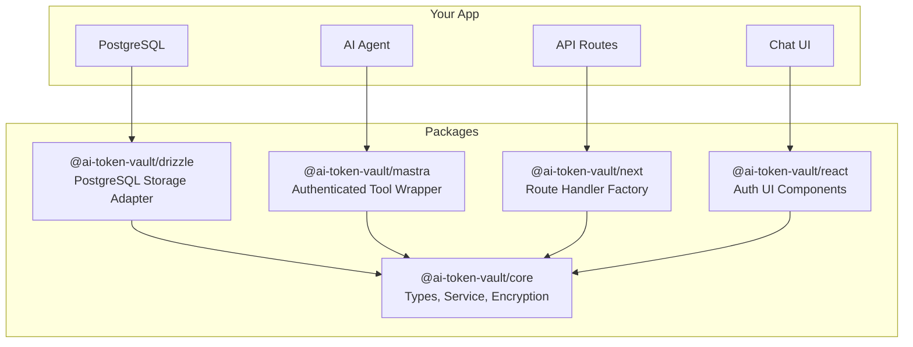
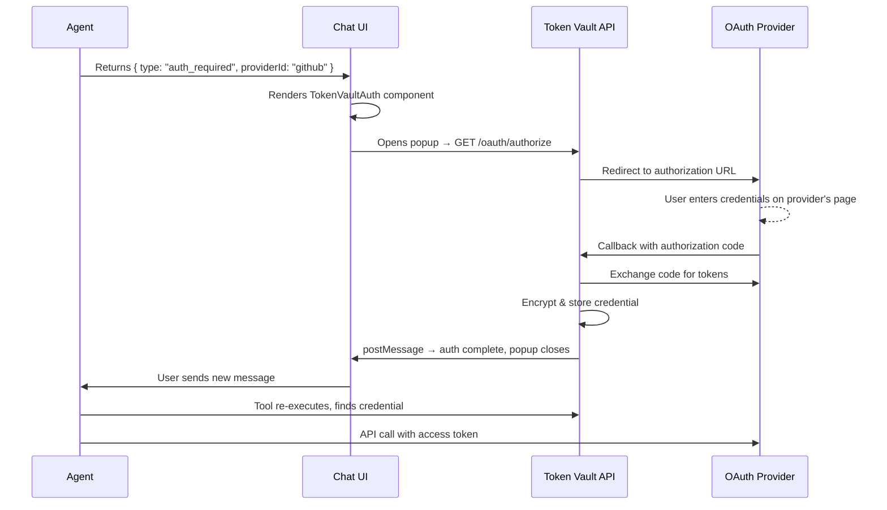
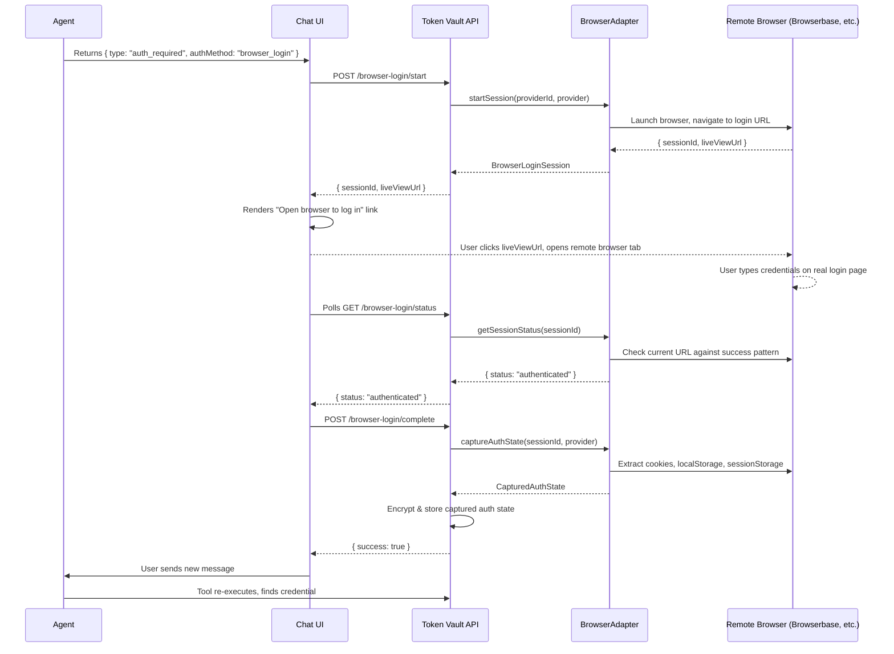

# AI Token Vault

Credential management for AI agents. Enables agents to pause mid-execution, prompt users to authenticate with external services (OAuth2 or browser login), then resume with valid credentials.

Credentials never flow through chat input. OAuth opens a popup to the provider's consent screen. Browser login opens a remote browser session the user controls via a live view URL — credentials are entered on the real service's login page, then cookies are captured server-side.

## Architecture



### Adapter Pattern

The core package defines four adapter interfaces — swap implementations without changing business logic:

| Adapter | Purpose | Default Implementation |
|---------|---------|----------------------|
| `StorageAdapter` | CRUD for providers, credentials, OAuth configs, nonces | `@ai-token-vault/drizzle` or `createMemoryStorage()` |
| `EncryptionAdapter` | Encrypt/decrypt sensitive fields at rest | `createAes256GcmEncryption()` |
| `SessionAdapter` | Extract user/org from incoming request | Bring your own (Better Auth, NextAuth, Clerk, etc.) |
| `BrowserAdapter` | Optional — launch remote browser for login, return `liveViewUrl` | Bring your own (Stagehand + Browserbase, Playwright, etc.) |

Key design decisions:
- Factory functions (not classes) for all construction
- Explicit dependency injection — no global singletons
- Organization support optional (nullable throughout)
- Drizzle FK references configurable — works with any user/org table

## Quick Start

```bash
pnpm add @ai-token-vault/core @ai-token-vault/next @ai-token-vault/react
```

```ts
// lib/vault.ts
import { createTokenVault, createAes256GcmEncryption, createMemoryStorage } from '@ai-token-vault/core';

const vault = createTokenVault({
  storage: createMemoryStorage(), // or createDrizzleStorage(db, schema)
  encryption: createAes256GcmEncryption(process.env.TOKEN_VAULT_SECRET!),
});
```

```ts
// app/api/token-vault/[...path]/route.ts
import { createTokenVaultRouteHandler } from '@ai-token-vault/next';

const handler = createTokenVaultRouteHandler({ vault, session: mySessionAdapter });
export { handler as GET, handler as POST, handler as DELETE };
```

## Auth Flows

### OAuth2 Flow

User clicks "Connect" in chat → popup opens to provider's consent screen → tokens stored server-side. Credentials never touch the chat.



### Browser Login Flow

For services without OAuth support. A remote browser session is started server-side, and the user gets a **live view URL** to see and control it — like a VNC session to a real browser. The user logs in on the actual service's login page. Once login is detected, cookies/localStorage/sessionStorage are captured server-side.



**Two deployment modes:**

| Mode | How user logs in | `liveViewUrl` |
|------|-----------------|---------------|
| **Cloud browser** (Browserbase, etc.) | User opens `liveViewUrl` in a new tab — sees and controls the remote browser | Returned by `BrowserAdapter.startSession()` |
| **Local headed browser** (dev only) | Playwright opens a visible window on the same machine — user interacts directly | Not needed (`null`) |

## Mastra Integration

```ts
import { createAuthenticatedTool } from '@ai-token-vault/mastra';
import { z } from 'zod';

const listRepos = createAuthenticatedTool({
  id: 'github-list-repos',
  description: 'List GitHub repositories for the authenticated user',
  providerId: 'github',
  providerName: 'GitHub',
  vault, // injected, not imported globally
  inputSchema: z.object({ page: z.number().optional() }),
  execute: async (input, { credential }) => {
    const res = await fetch('https://api.github.com/user/repos', {
      headers: { Authorization: `Bearer ${credential.accessToken}` },
    });
    return res.json();
  },
});
```

## Drizzle Storage (PostgreSQL)

```ts
import { createDrizzleStorage, createTokenVaultSchema } from '@ai-token-vault/drizzle';
import { user, organization } from './your-auth-schema'; // optional FK references

const schema = createTokenVaultSchema({ userTable: user, organizationTable: organization });
const storage = createDrizzleStorage(db, schema);
const vault = createTokenVault({ storage, encryption });
```

No FK references by default — pass `userTable`/`organizationTable` to add them. Works with any auth system's tables.

## React Components

### In-chat auth prompt

```tsx
import { TokenVaultAuth } from '@ai-token-vault/react';

<TokenVaultAuth
  providerId="github"
  providerName="GitHub"
  authMethod="oauth2"
  onAuthComplete={(id) => console.log('Connected:', id)}
/>
```

For browser login, the component automatically renders an **"Open browser to log in"** link when `liveViewUrl` is available.

### Settings page

```tsx
import { ConnectionsList, OAuthConfigForm } from '@ai-token-vault/react';

// ConnectionsList — shows connected services, revoke buttons
// OAuthConfigForm — secure form (password fields) for entering OAuth client ID/secret
```

`OAuthConfigForm` uses `type="password"` inputs with `autoComplete="off"` — credentials are never visible in chat or logs.

## Provider Configs

Pre-built provider configurations:

```ts
import { githubOAuthProvider, githubBrowserProvider } from '@ai-token-vault/core';
```

## Packages

| Package | Description |
|---------|------------|
| `@ai-token-vault/core` | Pure TS, zero deps — types, service, encryption, in-memory storage |
| `@ai-token-vault/drizzle` | Drizzle ORM storage adapter + schema factory with configurable FKs |
| `@ai-token-vault/mastra` | `createAuthenticatedTool()` wrapper for Mastra agents |
| `@ai-token-vault/next` | Next.js catch-all route handler factory (8 endpoints) |
| `@ai-token-vault/react` | `TokenVaultAuth`, `ConnectionsList`, `OAuthConfigForm`, hooks |

## Security

- All tokens, cookies, and OAuth client secrets encrypted at rest (AES-256-GCM)
- OAuth uses popup flow — credentials entered on provider's domain, never in your app
- Browser login uses remote browser — credentials entered on the real service's page via live view
- CSRF protection via nonce verification on OAuth state parameter
- Credential ownership verified before revocation
- `OAuthConfigForm` uses password fields — no plaintext credentials in UI

## License

MIT
